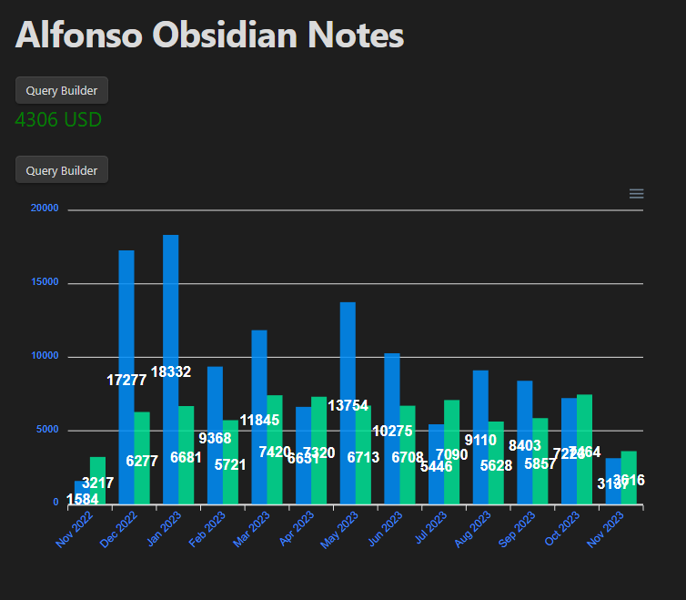
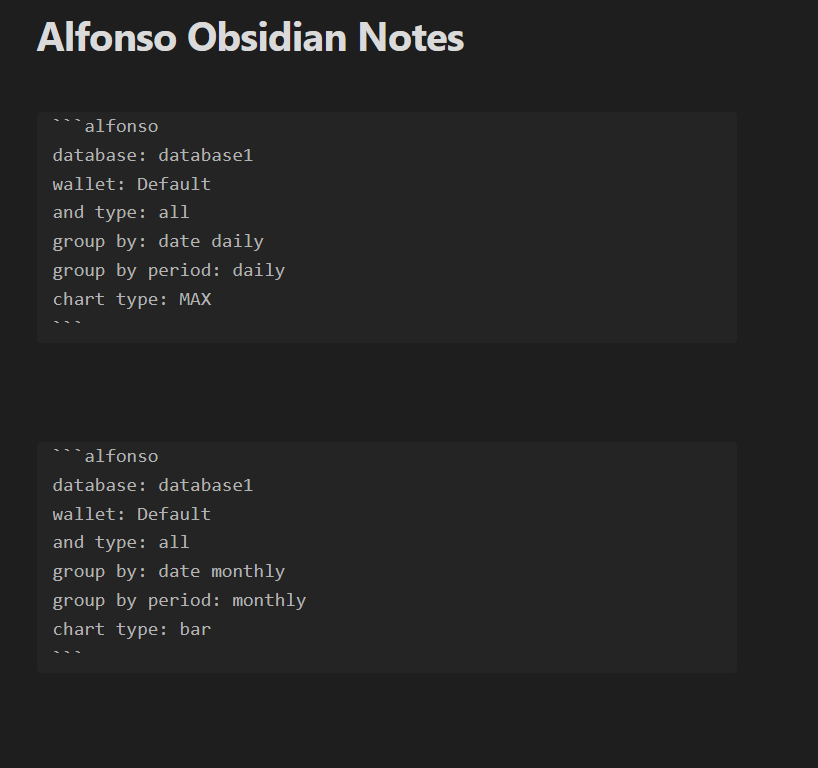

# Alfonso Money Manager - Obsidian Plugin

## Introduction

Alfonso Money Manager is a comprehensive mobile application designed for managing personal finances and budgets. It provides a robust platform for users to track their expenses, income, and budgeting goals with ease. The app features a local database that can be synchronized with an Obsidian vault, allowing for enhanced data visualization and analysis through the use of a specialized query language.

## Features

- **Local and Cloud Sync**: Keep your financial data with you at all times or synchronize it with your Obsidian vault for advanced analysis.
- **Customizable Queries**: Utilize the Alfonso Query Language (AQL) to extract precise information and generate reports based on your financial data.
- **Visualization with ApexCharts**: Leverage the power of ApexCharts within Obsidian to render beautiful and informative charts from your data.

*Example of a chart rendered in Obsidian using ApexCharts*

*Example of an AQL query in the Obsidian editor*

## Documentation

Dive into the comprehensive documentation to make the most out of Alfonso Money Manager:

- **[AQL Documentation](docs/AQL.md)**: Learn how to utilize the Alfonso Query Language to filter, group, and visualize your financial data.
- **[Settings Documentation](docs/Settings.md)**: Customize your experience by managing how Alfonso interacts with Obsidian and your financial data.

## Contributing

We welcome contributions of all forms to make Alfonso Money Manager better for everyone. Here's how you can help:

- **Reporting Bugs**: If you encounter any bugs or issues, please open an issue in the repository with a detailed description, steps to reproduce, and relevant screenshots if possible.
- **Feature Suggestions**: Have ideas for new features or improvements? Let us know by submitting an issue with the tag 'enhancement' and a detailed explanation of your proposed feature.

## Resources

- **Website**: For more information and updates, visit [SmartLifeGPT](https://smartlifegpt.xyz/?utm_source=GitHub&utm_medium=desktop).
- **Application**: Download and explore the Alfonso Money Manager from [here](https://smartlifegpt.xyz/alfonso-money-manger/?utm_source=PlayStore&utm_medium=app).
- **Obsidian Plugin**: Enhance your experience with the Alfonso Obsidian plugin available [here](https://smartlifegpt.xyz/alfonso-obsidian-plugin/?utm_source=PlayStore&utm_medium=app).
- **Kanban Board**: Track the progress and see what's coming next on our [Kanban board](https://github.com/users/smartlife-gpt/projects/1/views/1).

## Getting Started

1. **Download the App**: Get Alfonso Money Manager from the application link above and set up your account.
2. **Synchronize with Obsidian**: Connect the app to your Obsidian vault to start syncing data.
3. **Explore AQL**: Experiment with the Alfonso Query Language to customize and visualize your financial data.
4. **Visualize with ApexCharts**: Discover the power of data visualization through integrated charts and graphs.

## Support

If you need help or have any questions, please refer to our support page or join our community forum where fellow users and developers can assist you.

Thank you for choosing Alfonso Money Manager as your financial companion. We're excited to see the insights you'll gain and the goals you'll achieve with our app!

---

Alfonso Money Manager - Bringing clarity to your financial world.
