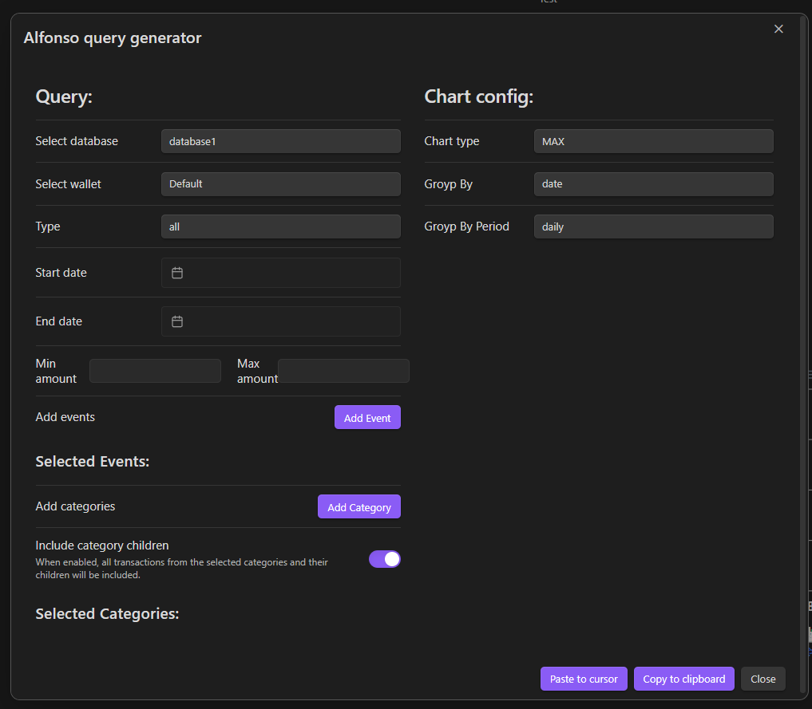

# Alfonso Query Language (AQL) Documentation

## Overview
Alfonso Query Language (AQL) is a powerful and intuitive language designed for querying transaction data within the Alfonso plugin for Obsidian. It allows users to specify criteria for filtering, grouping, and visualizing transactional data.

## UI Query Builder

The UI Query Builder provides a user-friendly interface for constructing queries without the need to manually type out the syntax. It allows users to select options and criteria from dropdowns and input fields, which are then translated into a valid AQL query.

### Features

- **Dynamic Form Fields**: Easily specify criteria for your transactions, such as dates, amounts, categories, and more.
- **Copy to clipboard**: Copy the generated AQL query to your clipboard with a single click.
- **Paste to cursor**: Paste the generated AQL query to your cursor position in the editor with a single click. If there is AQL at the cursor position, it will be replaced with the generated query.

### How to Use
1. Using command pallete `CTRL + P` or `CMD + P` in Obsidian.
2. Type `Alfonso Money Manager: Query Builder Window`

OR

1. **Accessing the Builder**: Click on the 'Query Builder' button above any AQL code block in the reading mode.
2. **Building the Query**: Select your criteria and fill in the necessary information in each section of the builder.
3. **Generating the Query**: Once you've set up your criteria, the builder will generate the AQL query for you.

### Screenshot



*Screenshot: UI Query Builder in action.*


## Query Structure
Each AQL query is composed of multiple lines, where each line specifies a part of the query. Here's the basic structure:

```alfonso
database: [DatabaseName]
wallet: [WalletName]
[Filtering Conditions...]
group by: [GroupingCriteria]
group by period: [Period]
chart type: [ChartType]
```

## Commands and Parameters

### Database
- **Syntax**: `database: [DatabaseName]`
- **Description**: Specifies the database to query.
- **Example**: `database: database1`

### Wallet
- **Syntax**: `wallet: [WalletName]`
- **Description**: Specifies the wallet within the database to query.
- **Example**: `wallet: Default`

### Filtering Conditions

#### Amount
- **Syntax**: `and amount [Condition]: [Value]`
- **Options**: `greater than`, `less than`, `between`, `exact`
- **Example**: `and amount greater than: 111`

#### Date
- **Syntax**: `and date [Condition]: [FormattedDate]`
- **Options**: `after`, `before`, `between`, `exact`
- **Example**: `and date after: 01/08/2023 14:57`

#### Category
- **Syntax**: `and category in: [CategoryNames]`
- **Description**: Filters transactions based on categories.
- **Example**: `and category in: Bills, Entertainment`

#### Include Subcategories
- **Syntax**: `and include categories children`
- **Description**: Includes transactions from subcategories.

#### Event
- **Syntax**: `and event in: [EventNames]`
- **Description**: Filters transactions based on events.
- **Example**: `and event in: Event1, Event2`

#### Transaction Type
- **Syntax**: `and type: [TransactionType]`
- **Description**: Filters transactions based on their type.
- **Example**: `and type: all`

### Grouping

#### Group By
- **Syntax**: `group by: [Field] [Period]`
- **Description**: Specifies the field and period for grouping transactions.
- **Options for Field**: `date`, etc.
- **Options for Period**: `daily`, `monthly`, etc.
- **Example**: `group by: date monthly`

#### Group By Period
- **Syntax**: `group by period: [Period]`
- **Description**: Specifies the period for grouping transactions.
- **Example**: `group by period: monthly`

### Chart Type
- **Syntax**: `chart type: [ChartType]`
- **Description**: Specifies the type of chart for visualizing data.
- **Options**: `bar`, `pie`, `line`, etc.
- **Example**: `chart type: bar`

## Examples

### Daily Grouping with Maximum Value Chart
```alfonso
database: database1
wallet: Default
and type: all
group by: date daily
group by period: daily
chart type: MAX
```

### Monthly Grouping with Bar Chart
```alfonso
database: database1
wallet: Default
and type: all
group by: date monthly
group by period: monthly
chart type: bar
```

## Notes and Tips

- **Whitespace and Case**: AQL is designed to be flexible with whitespace and case sensitivity.
- **Date Formatting**: Ensure dates are formatted correctly (DD/MM/YYYY HH:MM) for accurate processing.
- **Error Handling**: Provide clear error messages for syntax errors or unrecognized commands.


## Complex Examples

### Comprehensive Filtering with Line Chart
This query filters transactions based on multiple criteria and visualizes the result with a line chart, showing the trend over time.

```alfonso
database: financeDB
wallet: Main
and amount between: 50 and 500
and date after: 01/01/2023
and date before: 01/07/2023
and category in: Groceries, Utilities
and include categories children
and event in: MonthlyBill
and type: expense
group by: date weekly
group by period: weekly
chart type: line
```

### Yearly Overview with Bar Chart
This query provides a yearly overview of expenses for specific categories, visualized with a bar chart for easy comparison.

```alfonso
database: yearlyReview
wallet: AllAccounts
and amount greater than: 10
and date between: 01/01/2023 and 31/12/2023
and category in: Entertainment, Travel, Dining
and include categories children
group by: category yearly
group by period: yearly
chart type: bar
```

### Detailed Expense Breakdown with Pie Chart
This query offers a detailed breakdown of expenses in a specific month, showing the proportions of each category with a pie chart.

```alfonso
database: detailedExpenses
wallet: Family
and amount greater than: 20
and date between: 01/03/2023 and 31/03/2023
and type: expense
group by: category monthly
chart type: pie
```

### Advanced Analysis with Calculations
This query performs advanced analysis by calculating the total, average, and count of transactions over a specified period.

```alfonso
database: advancedAnalysis
wallet: Business
and amount greater than: 100
and date after: 01/01/2023
and date before: 01/06/2023
and category in: Sales, Services
group by: date monthly
group by period: monthly
chart type: line
calculate: SUM(amount), AVG(amount), COUNT()
```

## Crafting Your Queries

When crafting your own queries, consider the specific insights you wish to gain and how best to filter and present the data. AQL's flexibility allows for a wide range of queries to suit diverse analytical needs. Experiment with different combinations of conditions, grouping, and chart types to discover the full potential of your data.